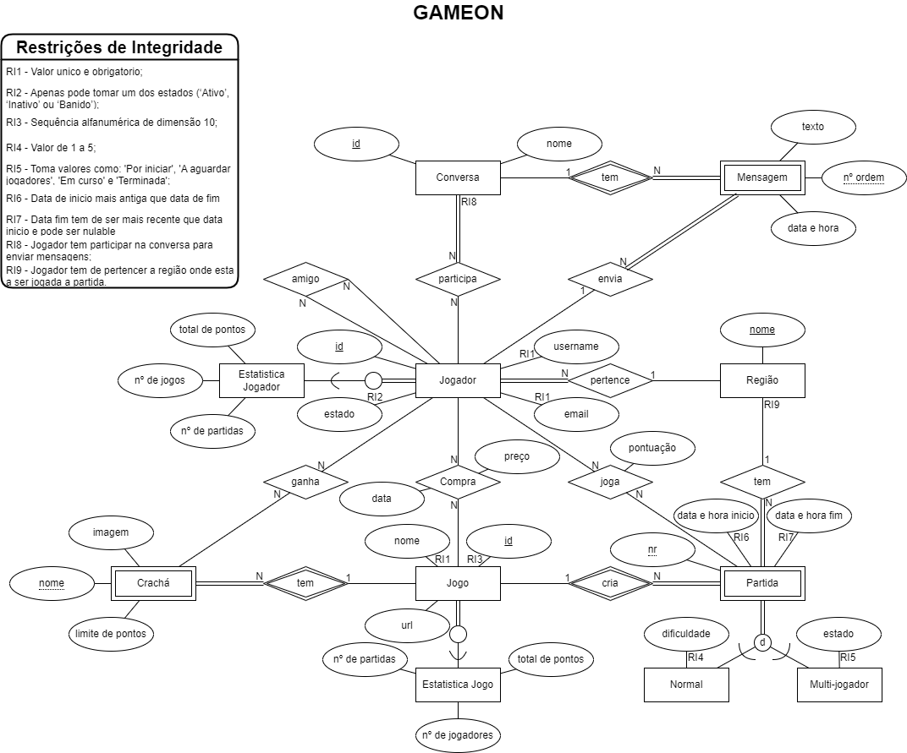

# Modelo Relacional

Construção do modelo relacional para a base de dados do projeto.

## Entidades
    
Regiao(<u>nome</u>)

Jogador (<u>id</u>, email, username, status)

Estatisca_jogador (nº de jogos, nº de partidas, total de pontos)

Compra(data, preço)

Jogo(<u>id</u>, url, nome)

Estatistica_jogo (nº de jogadores, nº de partidas, total de pontos)

Partida(<u style="text-decoration:underline dotted">nr</u>, data e hora inicio, data e hora fim)

Normal(dificuldade, pontuação)

Multi-jogador(estado, pontuação)

Cracha(<u style="text-decoration:underline dotted">nome</u>, imagem, limite de pontos)

Conversa(<u>id</u>, nome)

Mensagem(<u style="text-decoration:underline dotted">id</u>, texto, data e hora)

## Construção

    Região(nome)
    PK: Região(nome)
    FK: 

    Jogador(id, email, username, status, Região(nome))
    PK: Jogador(id)
    FK: Região(nome)

    Jogo(id, url, nome)
    PK: Jogo(id)
    FK:

    Conversa(id, nome)
    PK: Conversa(id)
    FK:
    
    Estatistica_jogador(nº de jogos, nº de partidas, total de pontos, Jogador(id))
    PK: 
    FK: Jogador(id)

    Estatistica_jogo(nº de jogadores, nº de partidas, total de pontos, Jogo(id))
    PK: 
    FK: Jogo(id)

    Partida(nr, data e hora inicio, data e hora fim, Jogo(id), Região(nome))
    PK: Partida(nr)
    FK: Jogo(id), Região(nome)

    Normal(dificuldade, pontuação, Partida(nr))
    PK: Partida(nr)
    FK: 

    Multi-jogador(estado, pontuação, Partida(nr))
    PK: Partida(nr)
    FK: 

    Cracha(nome, imagem, limite de pontos, Jogo(id))
    PK: Cracha(nome)
    FK: Jogo(id)

    Mensagem(nº de ordem, texto, data e hora, Conversa(id), Jogador(id))
    PK: Mensagem(nº de ordem)
    FK: Conversa(id), Jogador(id)

    Joga (Jogador(id), Partida(nr))
    PK: Jogador(id), Partida(nr)
    FK: Jogador(id), Partida(nr)
    
    Compra(data, preço, Jogador(id), Jogo(id))
    PK: Jogador(id), Jogo(id)
    FK: Jogador(id), Jogo(id)

    Ganha(Cracha(nome), Jogador(id))
    PK: Cracha(nome), Jogador(id)
    FK: Cracha(nome), Jogador(id)

    Participa(Jogador(id), Conversa(id))
    PK: Jogador(id), Conversa(id)
    FK: Jogador(id), Conversa(id)

    Amigo(Jogador(id), Jogador(id))
    PK: Jogador(id), Jogador(id)
    FK: Jogador(id), Jogador(id)

## Normalização

TODO()
